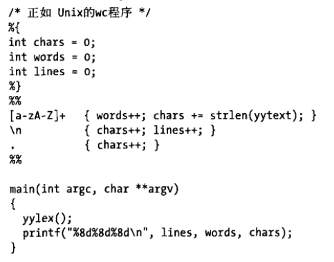
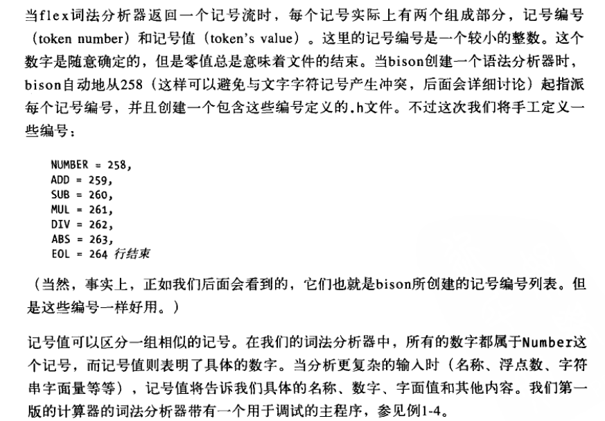
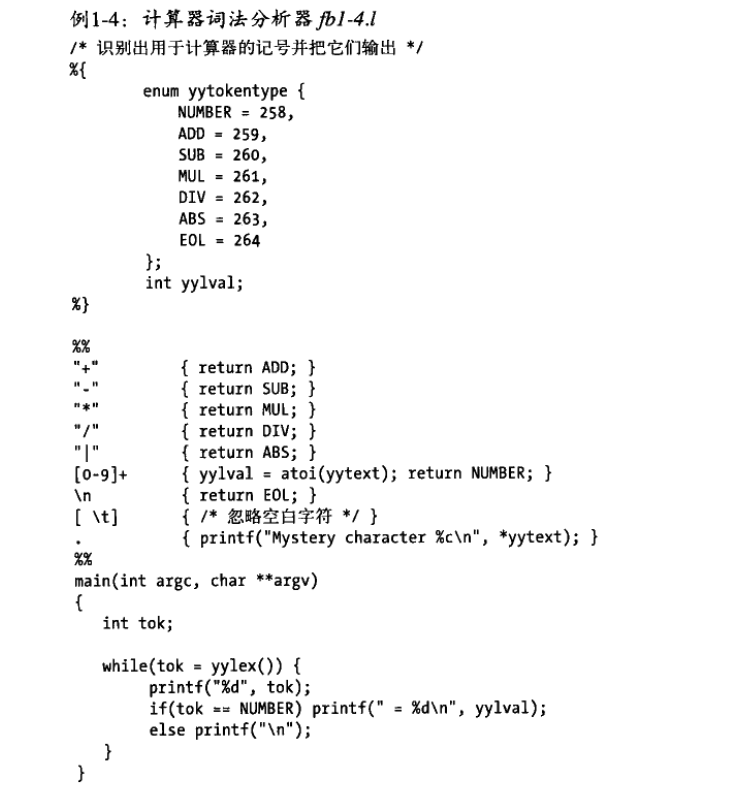
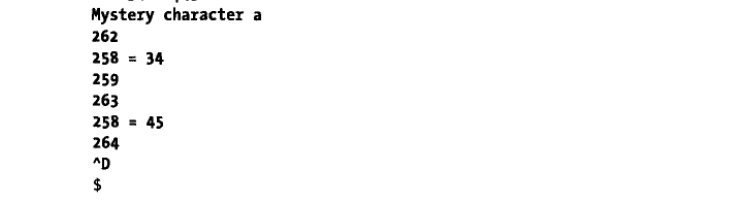
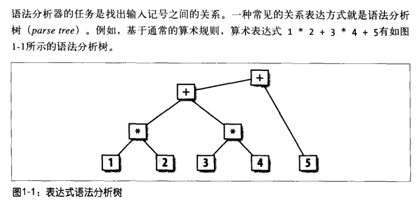
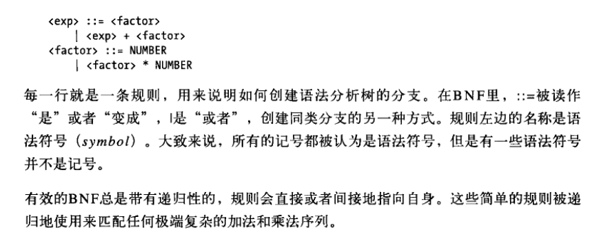
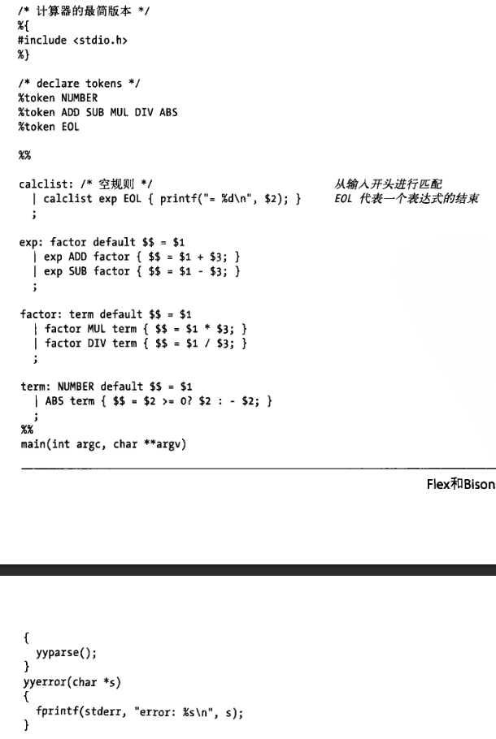
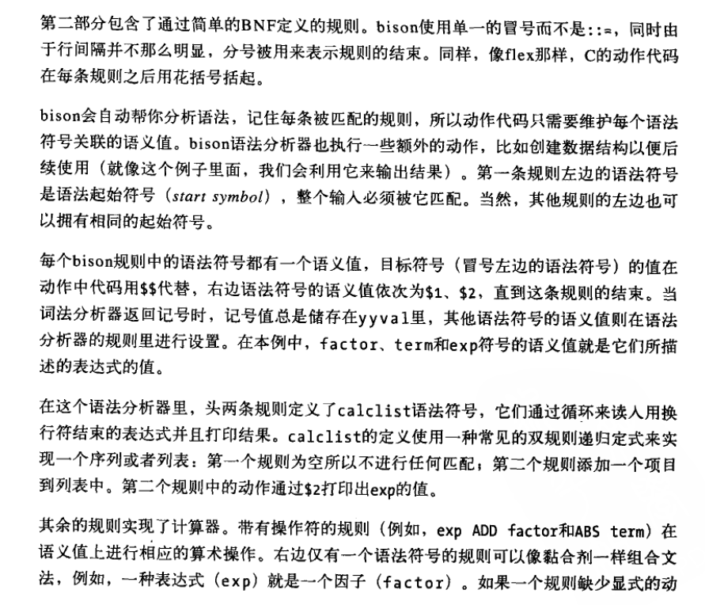
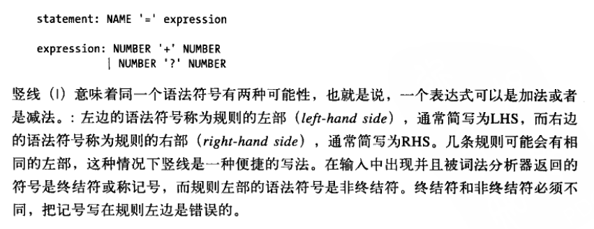
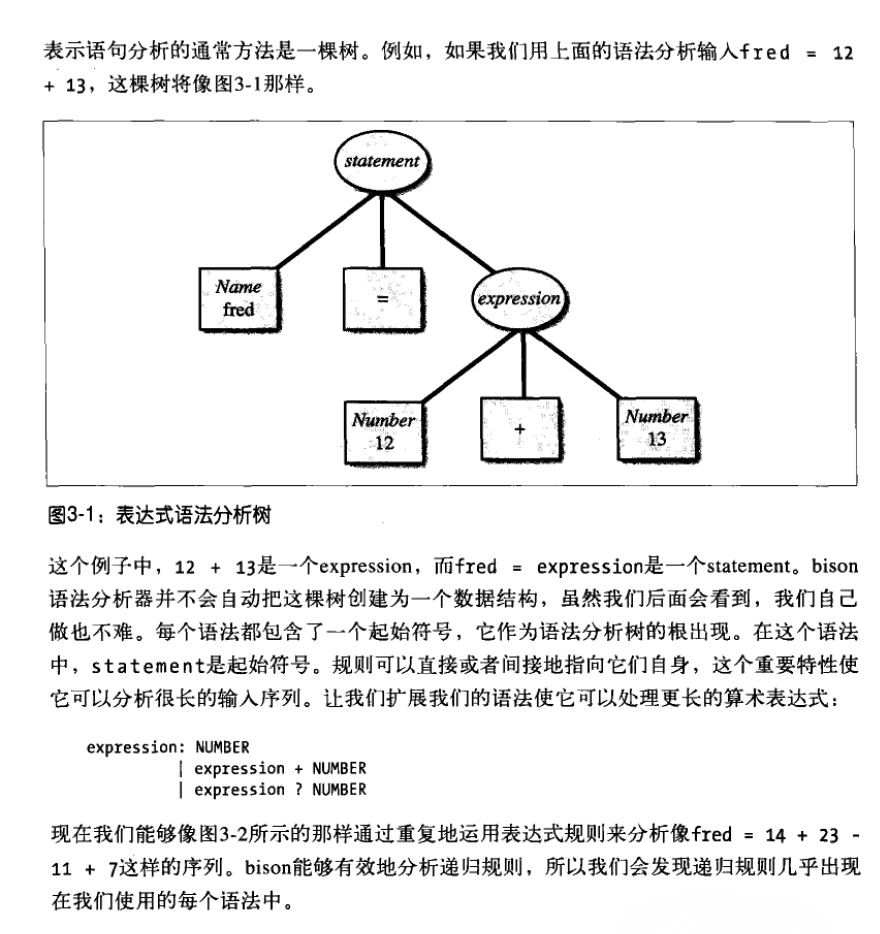

<!-- Created by Frank -->
- [flex \& bison Learning](#flex--bison-learning)
  - [flex \& bison 基础](#flex--bison-基础)
    - [1. 词法分析、语法分析](#1-词法分析语法分析)
    - [2. 正则表达式 \& 词法分析](#2-正则表达式--词法分析)
    - [3. flex 程序示例](#3-flex-程序示例)
    - [4. 作为协同程序的词法分析器](#4-作为协同程序的词法分析器)
    - [5. 记号编号和记号值](#5-记号编号和记号值)
    - [6. 语法分析树](#6-语法分析树)
    - [7. BNF 文法](#7-bnf-文法)
    - [8. Bison 规则](#8-bison-规则)
  - [使用 flex](#使用-flex)
    - [正则表达式](#正则表达式)
    - [正则表达式举例](#正则表达式举例)
    - [二义性的处理](#二义性的处理)
    - [lex 变量及函数](#lex-变量及函数)
  - [使用 Bison](#使用-bison)
    - [匹配输入](#匹配输入)

# flex & bison Learning
> 学习《flex & bison》小记

## flex & bison 基础
### 1. 词法分析、语法分析
* 词法分析
  * 输入分割成一个个有意义的词块，称为记号 (token)
  * token 代表了语句中不同类型的字符。token 大致上可以分为 关键字、标识符、数字、字符串、注释这几种
* 语法分析
  * 确定这些 token 如何关联

### 2. 正则表达式 & 词法分析
* 词法分析就是在输入中寻找字符的模式 (pattern)
* flex 程序由带指令的正则表达式组成
* 这些指令确定了匹配成功之后的动作 (action)

### 3. flex 程序示例

> 包含三个部分，由 `%%` 进行部分分割  

1. 声明和选项设置，会被原样抄到 .c 文件开头
2. 模式和动作 (用 `{}` 包住的 c 代码)
3. 会被 copy 到生成的词法分析器的 c 代码，主程序

### 4. 作为协同程序的词法分析器
* 获取 token 流
* 每当程序需要一个 token，调用 `yylex()` 读取输入
* 每次返回的时候，会记住当前处理的位置
* 如果有 action 返回，词法分析会在下一次 `yylex()` 调用时继续；否则，会立即继续运行

### 5. 记号编号和记号值

  

  

> `yylval` 用来存储记号值

### 6. 语法分析树

### 7. BNF 文法

上下文无关文法 (Context-Free Grammar, CFG)。BNF 文件是上下文无关文法的标准格式。  

### 8. Bison 规则

> 与 flex 类似，包含三个部分，由 `%%` 进行部分分割  

1. 声明和选项设置，会被原样抄到 .c 文件开头
2. 定义的规则和动作 (用 `{}` 包住的 c 代码)
3. 会被 copy 到生成的词法分析器的 c 代码，主程序

> 如果一个规则缺少显式的动作，则 `$1` 赋值给 `$$` (default)

## 使用 flex
### 正则表达式
| 字符 | 含义 |
| :---: | :---: |
| A-Z, 0-9, a-z | 构成了部分模式的字符和数字 |
| . | 匹配任意字符，除了 \n |
| - |	用来指定范围。例如：A-Z 指从 A 到 Z 之间的所有字符 |
| [ ] | 一个字符集合。匹配括号内的 任意 字符。如果第一个字符是 ^ 那么它表示否定模式。例如: [abC] 匹配 a, b, 和 C中的任何一个 |
| * |	匹配 0 个或者多个上述的模式 |
| +	| 匹配 1 个或者多个上述模式 |
| ? |	匹配 0 个或 1 个上述模式 |
| $ |	作为模式的最后一个字符匹配一行的结尾 |
| { } |	指出一个模式可能出现的次数。 例如: A{1,3} 表示 A 可能出现 1 次或 3 次 |
| \	| 用来转义元字符。同样用来覆盖字符在此表中定义的特殊意义，只取字符的本意 |
| ^	| 否定 |
| \|	| 表达式间的逻辑或 |
| "<一些符号>" | 字符的字面含义。元字符具有 | 
| /	| 向前匹配。如果在匹配的模版中的“/”后跟有后续表达式，只匹配模版中“/”前 面的部分。如：如果输入 A01，那么在模版 A0/1 中的 A0 是匹配的 |
| ( ) |	将一系列常规表达式分组 |

### 正则表达式举例
| 正则表达式 | 含义 |
| :---: | :---: |
| joke[rs] | 匹配 jokes 或 joker |
| A{1,2}shis+ | 匹配 AAshis, Ashis, AAshi, Ashi |
| (A[b-e])+ | 匹配在 A 出现位置后跟随的从 b 到 e 的所有字符中的 0 个或 1 个 |

### 二义性的处理
* 匹配输入时匹配尽可能多的字符串
* 如果两个模式都可以匹配的话，匹配在程序中出现的最早的模式

### lex 变量及函数
* 变量

  | 变量名 | 作用 |
  | :---: | :---: | 
  | yyin | FILE* 类型。它指向 lexer 正在解析的当前文件 |
  | yyout | FILE* 类型。它指向记录 lexer 输出的位置。缺省情况下，yyin 和 yyout 都指向标准输入和输出 |
  | yytext | 匹配模式的文本存储在这一变量中（char*）|
  | yyleng | 给出匹配模式的长度 |
  | yylineno | 提供当前的行数信息（lexer不一定支持）|

* 函数

  | 函数名 | 作用 |
  | :--: | :--: |
  | yylex() | 这一函数开始分析。它由 Lex 自动生成 |
  | yywrap() | 这一函数在文件（或输入）的末尾调用。如果函数的返回值是 1，就停止解析。 因此它可以用来解析多个文件。 代码可以写在第三段，这就能够解析多个文件。 方法是使用 yyin 文件指针（见上表）指向不同的文件，直到所有的文件都被解析。 最后，yywrap() 可以返回 1 来表示解析的结束 |
  | yyless(int n) | 这一函数可以用来送回除了前 n 个字符外的所有读出标记 |
  | yymore() | 这一函数告诉 Lexer 将下一个标记附加到当前标记后 |

## 使用 Bison
### 匹配输入

> statement, expression 是非终结符

> 表达式语法分析树