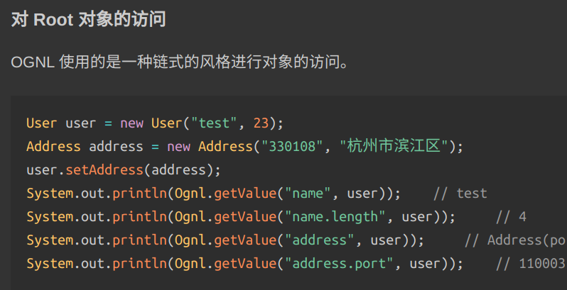
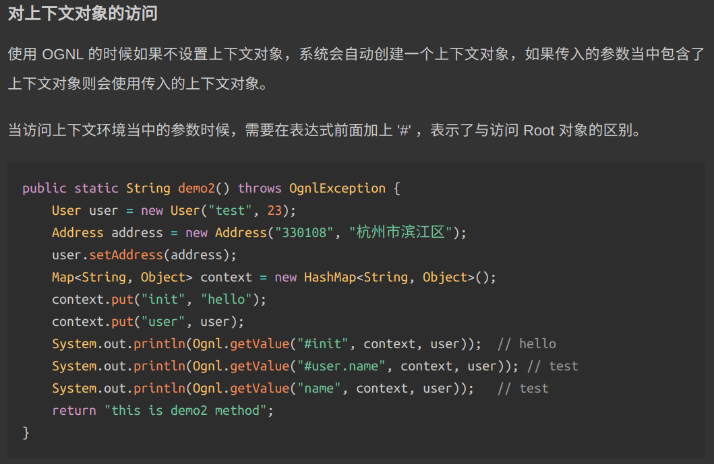
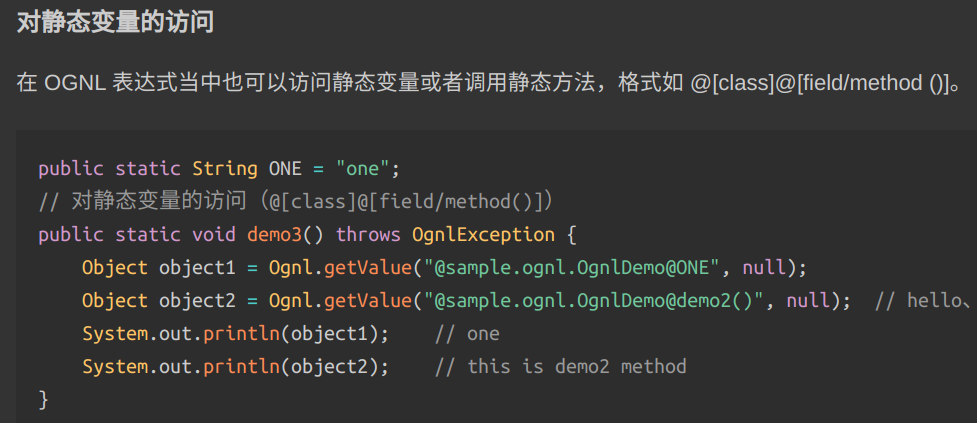
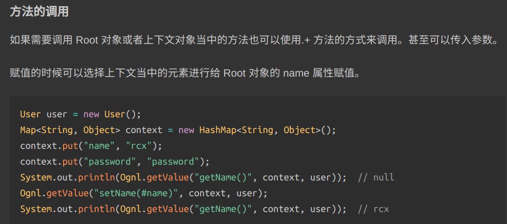
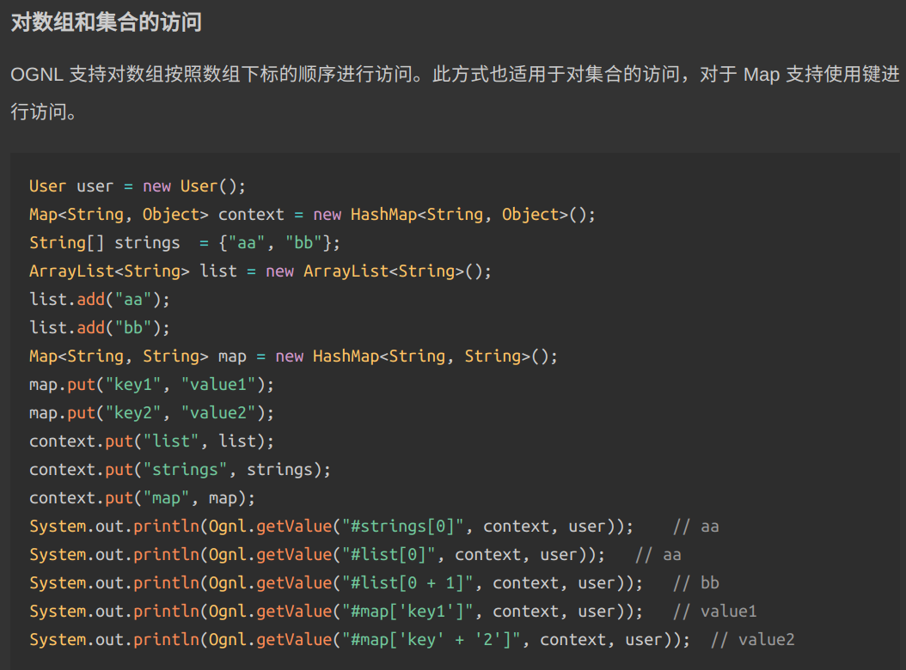
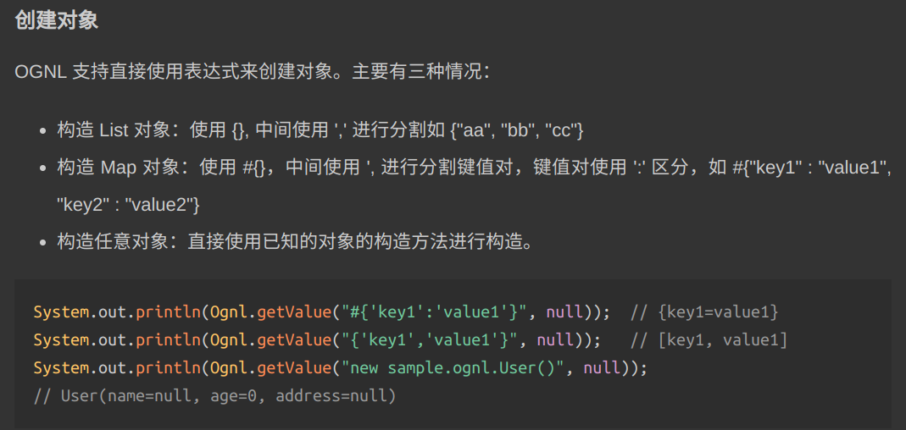
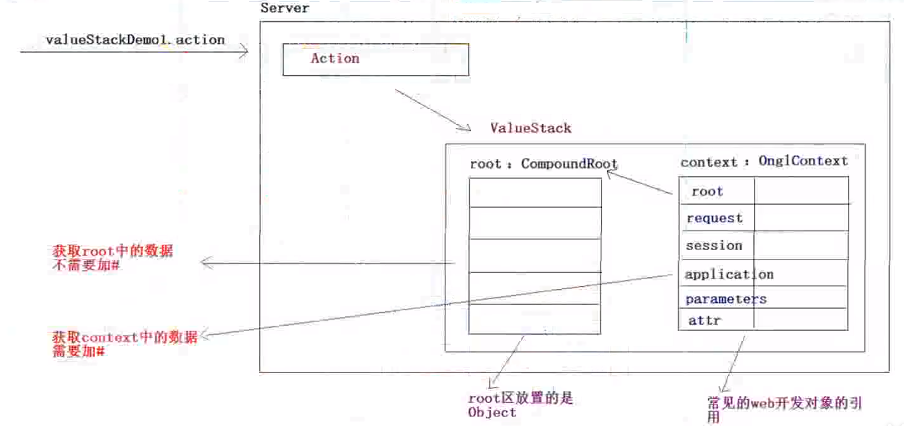
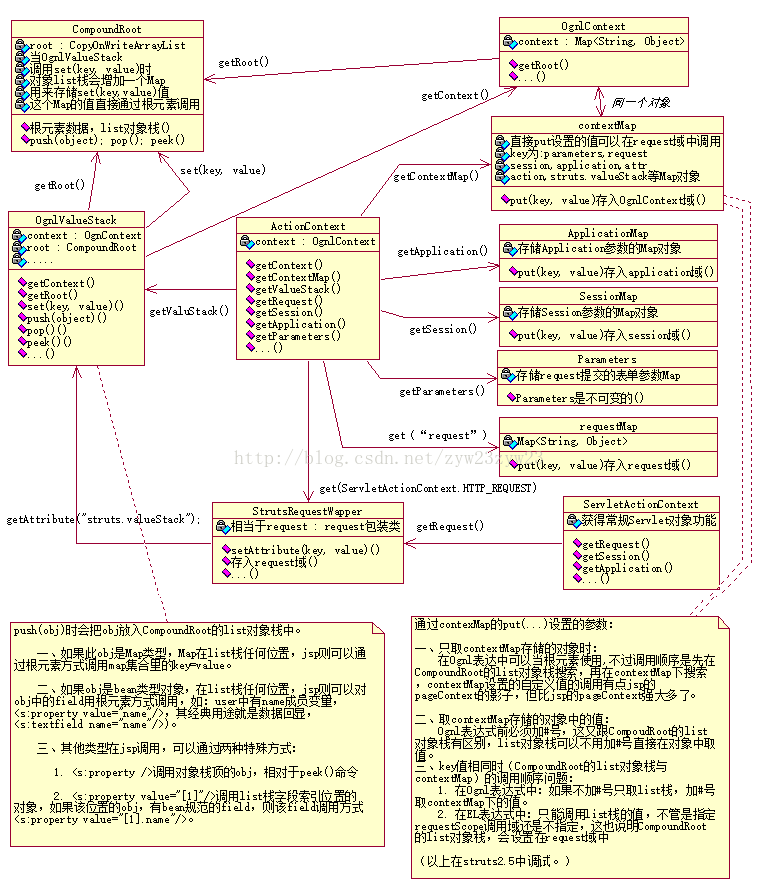

- [Java 表达式注入](#java-表达式注入)
  - [配置环境](#配置环境)
    - [安装 Docker](#安装-docker)
    - [安装 Vulhub](#安装-vulhub)
    - [启动、测试、移除](#启动测试移除)
  - [OGNL \& Struts2](#ognl--struts2)
    - [OGNL 基本知识](#ognl-基本知识)
    - [OGNL 基本使用](#ognl-基本使用)
    - [Struts2 - OGNL](#struts2---ognl)
    - [Struts2 ValueStack 操作](#struts2-valuestack-操作)
  - [Struts 漏洞学习](#struts-漏洞学习)
    - [struts1 Action](#struts1-action)
    - [struts2 Action](#struts2-action)
    - [S2-048](#s2-048)
    - [S2-052](#s2-052)
    - [S2-053](#s2-053)

<!-- 23/03/04 created by Frank. 记录Java表达式注入相关知识 -->

[document]: https://vulhub.org
[vulhub]: https://vulhub.org/#/docs/download-vulhub/
[vulhub-git]: https://github.com/vulhub/vulhub.git
[jianshu]: https://www.jianshu.com/p/e3c77c053359
[github.io]: https://jueee.github.io/2020/08/2020-08-15-Ognl表达式的基本使用方法/
[cnblog]: https://www.cnblogs.com/cenyu/p/6233942.html
[aliyun]: https://developer.aliyun.com/article/330637
[48_10]: https://blog.csdn.net/csh624366188/article/details/7550606
[49_11]: https://blog.csdn.net/csh624366188/article/details/7552950
[cnblog_shentoutest]: https://blog.csdn.net/weixin_53972936/article/details/127590995

# Java 表达式注入

## 配置环境

### 安装 Docker

* 参考 [Vulhub.org][document] 官方文档 

* root 权限一键安装
  
  ```
  sudo su
  
  curl -s https://get.docker.com/ | sh 
  ```

* 非 root 用户添加到 docker 组，避免输入 `sudo`
  
  ```
  sudo usermod -aG docker `frank`
  ```

* 配置 Docker 加速器 (root)
  
  ```
  curl -sSL https://get.daocloud.io/daotools/set_mirror.sh | sh -s http://f1361db2.m.daocloud.io
  
  systemctl restart docker.service
  ```

* 安装 Docker-compose  
  用于组合服务与内网。有部分环境涉及到多个容器，故用于做环境一键化管理工具。只需要简单地执行 ```docker-compose up -d``` 即可启动容器。
  
  ```
  sudo apt install python3-pip
  
  pip install docker-compose
  
  sudo apt install docker-compose
  ```

### 安装 Vulhub

* 参考 [Vulhub Download][vulhub] 下载文档

* 拉取 [Github][vulhub-git] 仓库
  
  ```
  git clone https://github.com/vulhub/vulhub.git ~/vulhub
  ```

### 启动、测试、移除

* 启动
  
  - 进入某个环境的对应目录
    
    ```
    cd ~/vulhub/flask/ssti
    ```
  
  - (编译) 运行 (需要 root 权限)
    
    ```
    docker-compose up -d
    ```

* 测试  
  查看启动环境
  
  ```
  docker-compose ps -a
  ```
  
  通过浏览器访问端口

* 移除
  
  ```
  docker-compose down
  ```

## OGNL & Struts2

* 参考 [Ognl 表达式的基本使用方法][github.io]
* 参考 [Ognl 表达式基本原理和使用方法][cnblog]
* 参考 [Ognl 概念和原理详解][aliyun]
* 参考 [Java程序员从笨鸟到菜鸟之（四十八）细谈struts2（十）ognl概念和原理详解][48_10]
* 参考 [Java程序员从笨鸟到菜鸟之（四十九）细谈struts2（十一）OGNL表达式的基本语法和用法][49_11]

### OGNL 基本知识

* OGNL 三要素
  
  - 表达式：带有语法含义的字符串。
  - root 对象：可以理解为 OGNL 的操作对象。
  - 上下文环境（Map 结构）：所有的操作都会在一个特定的数据环境中运行。

* 处理 OGNL 的最顶层对象是一个 Map 对象，通常称这个 Map 对象为 context map 或者 context，OGNL 的 root 就在这个 context map 中，在表达式中可以直接引用 root 对象的属性。

* OgnlContext 对象是 ognl 表达式语言的核心。Ognl 表达式语言取值，也是用 java 代码取值的，原理就是使用 `OgnlContext` 和 `Ognl` 这两个类。

* OgnlContext 对象在源码中实现了 `Map` 接口，所以 OgnlContext 本质就是一个 Map，可以使用 map 方法。
  
  ```java
  public class OgnlContext implements Map {……}
  ```

* map 方法  
  
  | 方法名                      | 作用                   |
  |:------------------------:|:--------------------:|
  | clear()                  | 从 Map 中删除所有映射        |
  | remove(Obj key)          | 从 Map 中删除键和关联的值      |
  | put(Obj key, Obj value)  | 将指定值与指定键相关联          |
  | putAll(Map t)            | 将 map t 所有映射复制到新 map |
  | get(Obj key)             | 返回与指定键关联的值           |
  | isEmpty()                | -                    |
  | size()                   | -                    |
  | containsKey(Obj key)     | -                    |
  | containsValue(Obj value) | -                    |

### OGNL 基本使用

* 使用前，先在 `pom.xml` 文件中引用 `ognl` 包

* OGNL 中的 `#`、`%` 和 `$` 符号
  
  - `#`: 
    
    - 获取 context 的数据（获取非 root 对象的数据）  
      由于Struts 2中值栈被视为根对象，所以访问其他非根对象时，需要加 `#` 前缀。实际上，`#` 相当于 `ActionContext.getContext()`
      
      ```jsp
      <s:property value="#session.name"/>
      ```
    
    - 构建 map 集合
      
      ```jsp
      // 作为对比
      // 构建 list
      <s:iterator var="i" value="{'aa', 'bb', 'cc '}">
          <s:property value="i"/> -- <s:property value="#i"/>
          <br/>
      </s:iterator>
      
      // 构建 map
      <s:iterator value="#{'aa':'11', 'bb':'22', 'cc':'33'}">
          <s:property value="key"/> -- <s:property value="value"/>
          <br/>
      ```
      
      输出
      
      ```jsp
      aa -- aa
      bb -- bb
      cc -- cc
      aa -- 11
      bb -- 22
      cc -- 33
      ```
    
    - 用于投影和选择（下面有例子）
  
  - `%`: 
    在某些标签中，强制识别 (强制不识别) ognl 表达式
    
    ```jsp
    不使用％：<s:url value="#foobar['foo1']" />
    使用％：<s:url value="%{#foobar['foo1']}" />
    强制不识别：<s:property value="%{'#foobar['fool']'}"/>
    ```
    
    输出
    
    ```jsp
    不使用%：#foobar['foo1']
    使用%：bar1
    强制不识别：#foobar['fool']
    ```
  
  - `$`: 
    强制识别 ognl 表达式
    
    - `.properties` 属性文件  
      国际化
      
      ```properties
      # message_zh_CN.properties
      user.welcome = 欢迎，${#session.user.username}
      
      # message_en_US.properties
      user.welcome = Welcome, ${#session.user.username}
      ```
    
    - `.xml` 配置文件
      
      ```xml
      <!-- 文件下载 -->
      <action name="download" class="xxx.downloadAction">
          <result type="stream">
              <param name="Content-Type">html</param>
              <param name="Content-Dispostion">attachment;filename=${user.username}</param>
          </result>
      </action>
      ```

* Ognl 的 `api` 
  
  ```java
  public static Object getValue(Object tree, Map context, Object root) throws OgnlException;
  
  public static void setValue(Object tree, Map context, Object root, Object value) throws OgnlException 
  ```

* 对 root 对象的访问  
  

* 对 context 对象的访问  
  

* 对静态变量和方法的访问  
  

* 方法调用  
    
  图片中调用了 root 对象中的方法，而传入该方法中的参数则是来自 context 对象。

* 对数组和集合的访问  
  

* 投影与选择（类似于数据库）
  
  - 投影：选出集合当中的相同属性组合成一个新的集合。语法为 collection.{ `公共属性` }。
  - 选择：选出集合当中符合条件的元素组合成新的集合。语法为 collection.{ `Y` `#逻辑表达式` }，其中 Y 是一个选择操作符。
  - 操作符：
    - ? ：选择满足条件的所有元素
    - ^：选择满足条件的第一个元素
    - $：选择满足条件的最后一个元素
  
  

* 创建对象  
  

### Struts2 - OGNL

* 在 Structs2 中，OGNL 的 context 变成了 `ActionContext`，root 变成了 `ValueStack`。ActionContext 中包含三个常见的作用域 request、session、application。

* `ValueStack` 贯穿整个 Action 的生命周期（每个 Action 类的对象实例都拥有一个 ValueStack 对象），即用户每次访问 Struts 的 action，<span style="color: red">都会创建一个`Action 对象`、`ValueStack 对象`、`ActionContext 对象`，然后把 `Action 对象` 放入 `ValueStack` 中；最后再把 `ValueStack 对象` 放入 request 中，传入 jsp 页面。</span> 相当于一个<span style="color: red">数据的中转站</span>，在其中保存当前 `Action 对象` 和 `其他相关对象`。Struts2 框架把 `ValueStack 对象` 保存在名为 `struts.valueStack` 的request请求属性中。

* `ValueStack` 存储对象时是分两个地方 `root (CompoundRoot)`, `context (OgnlContext)` 来存的，`ValueStack 对象`的组成是由 `List栈 (root区域)` 和 `Map栈 (context区域)` 构成：
  
  - <span style="color: red">`root (CompoundRoot)`</span>: 实质是一个 ArrayList，`Action 对象`、`Map 对象` 等对象，及全局属性存入。通常说的操作的值栈，就是操作 `root区域`。
  - <span style="color: red">`Context (OgnlContext)`</span>: 实质是一个 Map，存入数据，各种各样的映射关系（域数据）存入，包括 `root`、`parameter(请求参数)`、`request`、`session`、`application`、`attr`，Web 开发的常用对象的数据的引用。

* `ValueStack` 内部存储结构示意  
  

* `ValueStack` 和 `ActionContext` 的关系
  
  - 当一个request请求到来，执行过滤器中的 `doFilter(parList)` 方法，这个方法中创建了 `ActionContext` 对象，其中同时创建了 `ValueStack` 对象并且传递给了 `ActionContext` 对象，所以可以通过 `ActionContext` 获取 `ValueStack`
  - `ActionContext` 之所以可以访问到 `Servlet` 的域对象的数据，因为其中包含了 `ValueStack` 的引用

* Struts2 中各个对象的关系  
  

### Struts2 ValueStack 操作

* 获取 `ValueStack`
  
  - 通过 `ActionContext` 获得
    
    ```java
    ValueStack vs1 = ActionContext.getContext().getValueStack();
    ```
  
  - 通过 `request` 获得
    
    ```java
    ValueStack vs2 = (ValueStack) ServletActionContext.getRequest()
    
                      .getAttribute(ServletActionContext.STRUTS_VALUESTACK_KEY)
    ```
  
  - 一个 `Action` 实例，只会创建一个 `ValueStack`，因此 
    
    ```
    vs1 == vs2
    ```

* `ValueStack` 写入、获取数据  
  注意要引入标签。  
  Struts2 需要开启静态常量的开关，位于 `default.properties` 中，设置 `struts.ognl.allowStaticMethodAccess=true`
  
  * 取普通属性:  
    在Action中定义以下数据
    
    ```java
    private String str;
    //setter 和 getter 方法
    //或者将str修饰符设为public
    public String execute()
    {
    this.str="str";
    }
    ```
    
    在jsp中使用EL表达式获取
    
    ```jsp
    ${str}
    //或者用struts标签库
    <s:property value="str"/>
    ```
    
    部署运行后在jsp页面中显示 str
  
  * 取对象数据  
    先定义一个User类
    
    ```java
    public class User {
    private int id;
    private String name;
    public User(int id, String name) {
    super();
    this.id = id;
    this.name = name;
    }
    //setter and getter
    }
    ```
    
    在Action中声明User对象并创建
    
    ```java
    private User user;
    //setter and getter (getUser() {return user;})
    public String execute()
    {
    this.user = new User(1,"user1");
    return "success";
    }
    ```
    
    在jsp中获取user的属性
    
    ```jsp
    <s:property value="user.id" />//${user.id}
    <s:property value="user.name"/><br/>//${user.name}
    ${user.id}${user.name}
    ```
    
    部署运行后在jsp页面显示
    
    ```jsp
    1user1
    ```
  
  * 取List集合中的数据  
    Action中定义
    
    ```java
    private List<User> list;
    //setter and getter
    public String execute(){
    this.list = new ArrayList<User>();
    //模拟存入数据
    for(int i=0; i<3; i++){
    list.add(new User(i,"username"+i));
    }
    return "success";
    }
    ```
    
    Jsp页面中获取
    
    ```jsp
    <s:iterator var="u" value="list">//value为Action集合List对  象的名称
    <s:property value="#u.id"/>//${u.id}
    <s:property value="#u.name"/><br/>//${u.name}
    </s:iterator>
    ```
    
    部署运行后在jsp页面显示
    
    ```jsp
    0 username0
    1 username1
    2 username2
    ```
  
  * 取Map集合中的数据  
    在Action中定义对象
    
    ```java
    private Map<String, User> map;
    //setter and getter
    public String execute(){
    this.map = new HashMap<String, User>();
    for(int i=0; i<3; i++){
    map.put("user"+i,new User(i,"username"+i));
    }
    return "success";
    }
    ```
    
    在JSP中取数据
    
    ```jsp
    <s:iterator var="u" value="map">//u is a entry
    //EL取值
    <s:property value="#u.key"/>//${u.key}
    <s:property value="#u.value.id" />//${u.value.id}
    <s:property value="#u.value.name"/><br/>//${u.value.name}
    </s:iterator>
    ```
    
    部署运行后显示
    
    ```jsp
    user0 0 username0
    user2 2 username2
    user1 1 username1
    ```

## Struts 漏洞学习

* 参考[【渗透测试】Struts2系列漏洞][cnblog_shentoutest]
* 参考 [JAVA表达式注入漏洞][jianshu]
* 参考 [struts1 Action原理与配置](https://blog.csdn.net/u011229848/article/details/53212986)
* 参考 [struts2的工作原理与流程](https://blog.csdn.net/a519781181/article/details/51542588)

### <a id="struts1-action">struts1 Action</a>

  工作流程：

  * 初始化：struts 框架的总控制器 ActionServlet 在 web.xml 中配置成自动启动的 Servlet，读取配置文件(struts-config.xml)的配置信息，初始化相应的对象 (面向对象思想)
  * 发送请求：用户提交表单或通过 URL 向 WEB 服务器提交请求
  * form 填充：ActionServlet 在用户提交请求时将数据放到对应的 form 对象中的成员变量中
  * 派发请求：控制器根据配置信息对象 ActionConfig 将请求派发到具体的 Action，对应的 formBean 一并传给这个 Action 中的 excute() 方法
  * 处理业务：Action 一般只包含一个 excute() 方法，它负责执行相应的业务逻辑(调用其它的业务模块)。完毕后返回一个 ActionForward 对象。服务器通过 ActionForward 对象进行转发工作
  * 返回响应：Action 将业务处理的不同结果返回一个目标响应对象给总控制器
  * 查找响应：总控制器根据 Action 处理业务返回的目标响应对象，找到对应的资源对象，一般情况下为 jsp 页面
  * 响应用户：目标响应对象将结果传递给资源对象，将结果展现给用户

Struts 核心：

  * `Action`, `ActionForm`, `ActionForward`
    - `ActionForm`: 配置 ActionForm，必须包含 ActionForm 类。Struts 要求ActionForm 必须继承 Struts 的基类: org.apache.struts.action.ActionForm。ActionForm 的属性必须与 JSP 页面的表单域相同。
    - `Action`: 负责管理与之关联的 ActionForm。通过 ActionForm，可使 Action 无须从 HTTP 请求中解析参数。因为所有的参数都被封装在 ActionForm 中。必须重写 `public ActionForward execute(mapping, form, req, res)` 核心方法，该方法 form 将表单的请求参数封装成值对象。
    - `ActionForward`: 封装转发路径，也就是完成页面的跳转和转向。
  
  * 实际的过程是: ActionServlet 拦截到用户请求后，根据用户的请求，在配置文件中查找对应的 Action，Action 的 name 属性指定了用于封装请求参数的 ActionForm; 然后 ActionServlet 将创建默认的 ActionForm 实例，并调用对应的 setter 方法完成 ActionForm 的初始化。 
  
  * Action 类的 `execute()` 方法的參数和返回值：
    - ActionMapping：包括了这个 Action 的配置信息，和 strutsconfig.xml 文件里的`<action>` 元素相应
    - ActionForm：包括了用户的表单数据。当 Struts 框架调用 execute() 方法时 ActionForm 中的数据已经通过了表单验证
    - HttpServletRequest：当前的HTTP请求对象
    - HttpServletResponse：当前的HTTP响应对象
    - Action 类的 execute() 方法返回 ActionForward 对象。它包括了请求转发路径信息


### <a id="struts2-action">struts2 Action</a>

  工作流程：  
  
  

  * 客户端初始化一个指向 Servlet 容器的请求 
  * 这个请求经过一系列的过滤器（Filter）
  * 接着 FilterDispatcher 被调用，FilterDispatcher 询问 ActionMapper 来决定这个请是否需要调用某个 Action 
  * 如果 ActionMapper 决定需要调用某个 Action，FilterDispatcher 把请求的处理交给 ActionProxy 
  * ActionProxy 通过 Configuration Manager 询问框架的配置文件，找到需要调用的 Action 类 
  * ActionProxy 创建一个 ActionInvocation 的实例 
  * ActionInvocation 在调用Action的过程前后，涉及到相关拦截器的调用。 
  * Action 执行完毕，ActionInvocation 根据 struts.xml 中的配置找到对应的返回结果

  struts2 中的 Action：

  * execute 方法一定要返回 String 类型的对象,每一个字符串都可以对应一个跳转的页面。(字符串是可以自己随便定义的,字符串对应哪一个跳转的页面也是自己定义,在 struts.xml 文件中定义)


### S2-048

[s2-048.md](./s2-048/s2-048.md)

### S2-052


### S2-053

