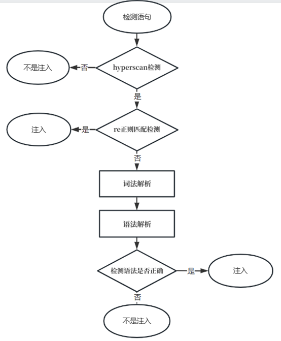

# 一些问题 & 解答



## 1. Hyperscan 模块的作用？
> 过滤白流量  

白噪音筛选，尽可能的筛选掉不可能构成注入的数据，避免大量的白噪音数据进入模型导致模型运行效率降低，降低白噪音对检测结果的影响。  

## 2. RE 正则匹配的作用？
> 匹配注入语句

将常见的注入语句中，影响注入权重较高的部分，提取出来作为注入成分库。如果检测语句与注入成分库中的注入片段成功 RE 匹配，判定该语句有注入风险。  

## 3. Hyperscan 和 RE 正则匹配的顺序？

先 Hyperscan，后 RE 正则匹配。如果先 RE 正则匹配，就会有大量的白流量也参与到了 RE 正则匹配，导致效率降低。

## 4. Python 版本和 C 语言版本？

最终提交 C 语言版本。Python 版本作为 demo，检验模型思路是否正确。

## 5. ognl.y 文件核心要点
### func_expr
> 原版可能会匹配到 `@java.lang.Runtime@a().b().c()`，这是不希望匹配到的。正确的是 `@java.lang.Runtime@a()`。  
> 修改后，将 `func_name` 单独拎出来归约成 `func_test`，可以避免误报。自己动笔试试走流程。主要是归约冲突。
```cpp
/* 原版 */
injection_sentence : '@' java_class_expr '@' func_expr
                    | '@' java_class_expr '.' func_expr
                    | '#' IDENT '=' new_expr java_class_expr '@' func_expr
                    | '#' IDENT '=' new_expr java_class_expr '.' func_expr
                    | new_expr java_class_expr '@' func_expr
                    ;
new_expr : NEW 
         | /*EMPTY*/
         ;

func_expr : func_name '(' func_list ')' 
            | func_expr '.' func_expr
            ;


/* 修改后 */
injection_sentence : '@' java_class_expr '@' func_expr
                    | '@' java_class_expr '.' func_expr_test
                    | '#' IDENT '=' new_expr java_class_expr '@' func_expr
                    | '#' IDENT '=' new_expr java_class_expr '.' func_expr_test
                    | new_expr java_class_expr '@' func_expr
                    ;
new_expr : NEW 
         | /*EMPTY*/
         ;

func_expr_test : func_expr
               | func_expr '.' func_expr_test
               ;

func_expr : func_name '(' func_list ')' 
          ;
```

### dirty_string 脏字符
> 脏字符可能出现在各种位置，可能有各种符号
```cpp
// 权限语句
authority_sentence : memberaccess_sentence 
                   | context_sentence
                   | authority_sentence ',' authority_sentence 
                   | authority_sentence ',' dirty_sentence
                   | dirty_sentence ',' authority_sentence
                   ;
// 脏语句
dirty_sentence : dirty_char
               | dirty_sentence dirty_char
               ;
// 脏字符
dirty_char : IDENT
           | ICONST
           | FCONST
           | dirty_op
           | SCONST
           ;

dirty_op : '+'
         | '-' 
         | '*'
         | '&'
         ;
```