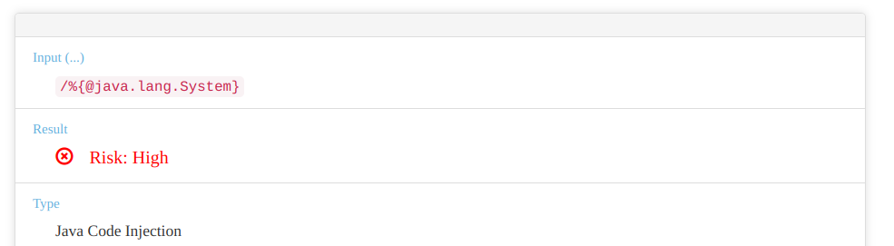
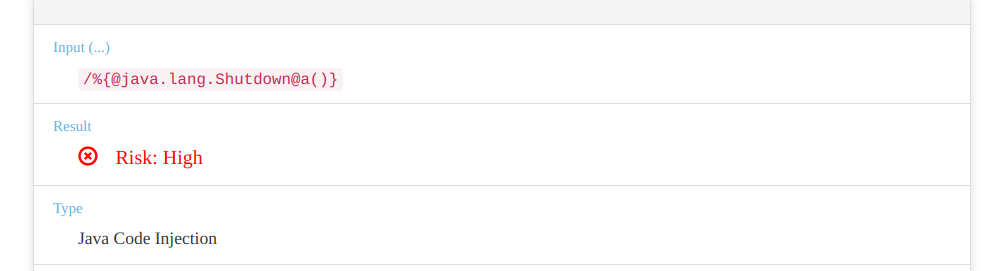
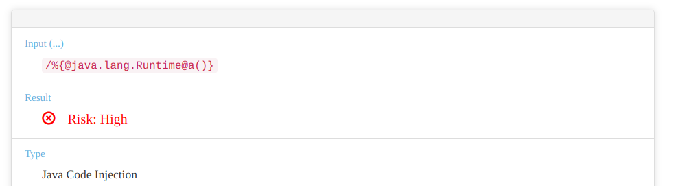
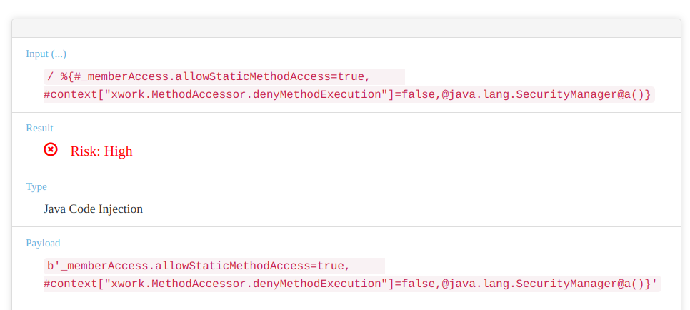
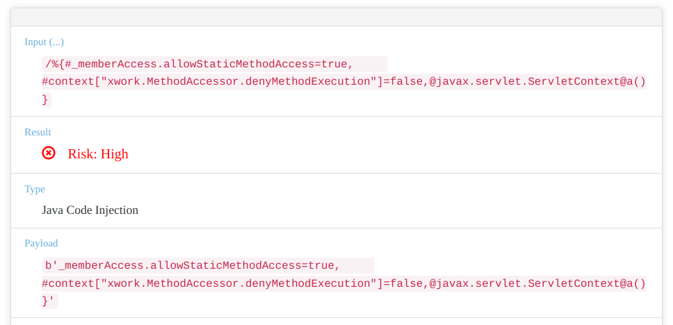

<!-- Created by Frank -->
# Classification

## 1. 类名
* java.lang.ClassLoader
* javax.script.ScriptEngineManager
* java.lang.RuntimePermission
* java.lang.ProcessBuilder (按上周的应该是，但我一次都没碰到 high risk)
* java.lang.System  
  

## 2. 类名 + 任意方法 (@a())
* java.lang.Shutdown  
  
* com.opensymphony.xwork.ActionContext
* java.lang.Runtime (概率极低的事件，无法确定是否具有参考性哈哈哈) 
  

## 3. 类名 + 特定方法
* java.lang.Class

## 4. 权限语句 + 类名
* sun.misc.Unsafe
* java.lang.ThreadGroup
* java.lang.Compiler
* java.lang.Thread
* com.atlassian.core.util.ClassLoaderUtils
* java.lang.InheritableThreadLocal
* com.atlassian.core.util.ClassHelper
* java.lang.ThreadLocal
* java.lang.Package
* java.lang.SecurityManager
  
* javax.servlet.ServletContext  
  

## 5. 其他
* classLoader
* com.atlassian.applinks.api.ApplicationLinkRequestFactory
* class
* java.lang.Process
* org.apache.tomcat.InstanceManager
* javax.persistence.EntityManager
* org.springframework.context.ApplicationContext
* java.lang.Object